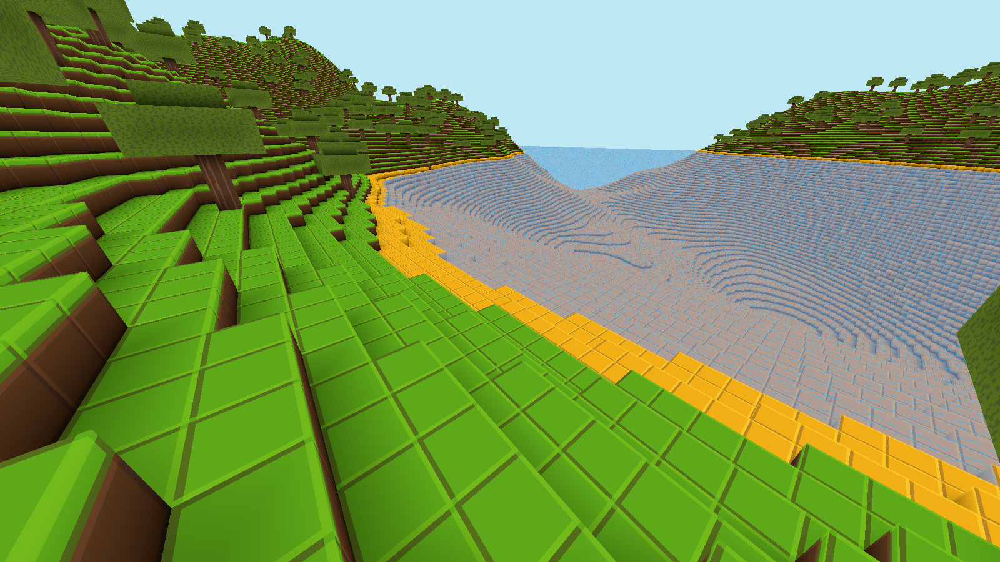

# voxel-toy

A voxel toy written in rust for the purpose of learning wgpu.

Some of the current features include infinite terrain gen, transparent water, breakable blocks,
tree generation, ambient occlusion, multithreaded chunk generation and meshing.

At some point I plan to come back to this, clean it up, and add more features. But for now,
I'm going to leave it as is and move onto some other projects.

